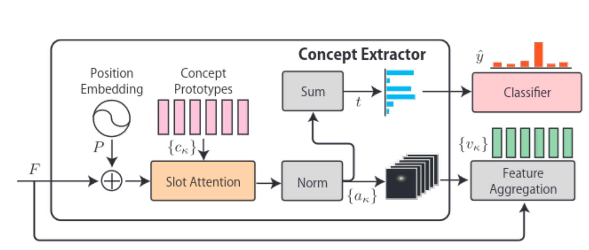

# CNN
畳み込み層

# ResNet
## ResNet18

# Slot Attention

# BotCL
## Model

### 기본용어 정리
* $D=\{(x_{i}, y_{i}|i=1, 2,...,N)\}$ : 입력 dataset 
  * $x_{i}$ : image, $y_{i} \in \Omega$ : target class label, $\Omega$: target class label set
* feature map $F = \Phi(x)\in \mathbb{R}^{d \times h \times w}$
  * $\Phi$ : 모델의 backbone CNN
* $g_{C}$ : concept extractor
  * $C$ : 각 $\kappa$번째 벡터 $c_{\kappa}$가 학습 대상인 Concept Prototypes인 행렬
* $t\in [0, 1]^{k}$ : concept bottleneck activations, 각 concept의 존재여부를 표현
* $V\in \mathbb{R}^{d \times k}$ : concept features, 각 concept들이 존재하는 영역
* $a_{\kappa} \in [0, 1]^{l}$ : Attention

### 모델 개요
BotCL은 기존 분류 과제를 수행하면서 $k$개의 concept를 학습 

새 입력 이미지 $x$에 대하여, feature map $F = \Phi(x)\in \mathbb{R}^{d \times h \times w}$를 추출. 
  * $\Phi$는 모델의 backbone CNN

그 후, F는 concept extractor $g_{C}$에 입력됨. concept extractor는 concept bottleneck activations $t \in [0, 1]^{k}$랑 concept features $V \in \mathbb{R}^{d \times k}$를 생산

$t$는 classifier의 입력으로 사용되어, score $s \in [0, 1]^{|\Omega|}$ 계산에 사용.
### 1.1. Concept extractor
Concept extractor는 slot attention 기반으로 $D$의 visual concept들을 발견.

먼저, feature map $F$에 position embedding $P$를 더해서 spatial information을 보존. 
> $F'=F+P$ 

여기서 position embedding은 이미지에서 그리드가 어디에 위치

$F'$의 spatial dimension은 flattened. 그래서 모양은 $l \times d$
* $l = hw$ ( $h$=height, $w$=width, $d$=depth ) 

다음, slot-attention은 concept $\kappa$에 기반해서 $c_{\kappa}$랑 $F'$을 사용해서 spatial dimension에서의 attention을 계산. 

$Q(c_{\kappa})$랑 $K(F')$는 $c_{\kappa}$랑 $F'$에 대한 비선형변환을 표현. 각각 3개의 FC층과 그 사이에 ReLU 비선형함수가 있는 다중 퍼셉트론.

Attention $a_{\kappa} \in [0, 1]^{l}$는 정규화함수   
$\phi$ 를 사용해서
>$a_{k} = \phi (Q(c_{\kappa})^{\top}K(F'))$
로 주어짐.

attention은 concept $\kappa$가 어디에 존재하는지 표현. concept $\kappa$가 존재하지 않을때, $a_{\kappa}$에 대응하는 entries는 모두 0에 가까움. 

Attention $a_{\kappa}$의 spatial dimension을 줄여서 concept activation $t_{\kappa} = \tanh(\Sigma_{m} a_{\kappa m})$로 표현함으로서, 각 concept의 존재여부를 요약. 여기서 $a_{\kappa m}:a_{\kappa}$의 $m$번째 요소

# 교수님한테 배운것들

## Flattened?
flattened란 cnn에서 추출된 벡터(밧치?)들을 뽑아서 하나로 나열하는 것. 하나로 나열해버리면 주위의 배치관계등의 정보는 상실해버림. 그래서 쓰는게 position embedding
## Position embedding?

## 각종 Loss들 
1. $l_{cls}$ : cross-entropy를 의미. target 분류 과제의 loss. 어느 클래스와 일치하면 작아지고 다르면 아주 커지는? 자세한건 다시 찾아보자
2. $l_{con}, l_{dis}$ : consistent loss, distinctive loss를 의미. 
  * consistent loss : 같은 컨셉들끼리는 특징량이 비슷해지길 원함
  * distinctive loss : 다른 컨셉끼리는 멀어지길 원함
3. $l_{qua}$ : quatization loss, t가 0부터 1사이의 값인데, 0.5만큼 어떤 concept을 가진다는건 이상하니까, t가 0 혹은 1에 어딘가에는 가까워지도록(0.5가 안되도록) 조정하는 loss 

Reconstructive loss는 mnist에, contrastive loss는 그 외에 사용됨. 왜냐? mnist는 배치가 명확?해서 (예를 들어 7을 그리려면 짝대기 2개가 정확히 어디서 꺾이는지 알아야됨) 추출한 concept들로 reconstruct하기 쉬움. 그런데 개 그림은 뭐 눈이 어디있고 입이 어디있던 강아지마다 달라서 어려움. 그래서 constrastive loss를 사용.
## 흐름?
concept prototype은 갯수만 주어지고, 이 개수만큼의 컨셉들을 이미지에서 찾아서 학습. 이 컨셉들을 사용하면 잘 분류가 되네~를 학습.

## 내가 연구할 것들
CNN이나 transformer를 통과하고 마지막에 나오는건 이런 패턴이 포함되어있다~같은 의미(특징)정보가 많이 포함된 고차원의 벡터. 반면 초기단계에서는 RGB정보밖에 없는, 의미가 별로 포함되지 않은 저차원의 벡터. 의미가 적은 低レベル、중간 정도의 中レベル、많은 高レベル이라 하면(저중고 3개 정도로 하면 될듯), 그것들을 활용해서 분류 문제에서 低レベル를 사용하면 빠르게 분류할수 있게 해보자(예를 들어 까마귀랑 갈매기를 분류하면 까마귀는 검은색, 갈매기는 하얀색이니까 바로 분류 가능). 단, 低レベル　高レベル 뭘 쓸지를 자동으로 하는 걸로.

Transormer는 사이즈가 계속 동일하니까 쉬움. CNN은 高レベル로 갈수록 벡터의 차원이 높아지니까 低レベル벡터의 차원을 高レベル로 맞춰야 자유롭게 사용가능.

RGB값들을 평균시키고 나온 벡터를 512x3행렬에 곱하면 512x3 곱하기 3x네모-> 512x네모로 맞춰짐(?) 그림보고 한번 더 생각해봐야될듯
# TODO
* 연구할것들 다시 생각
* 
