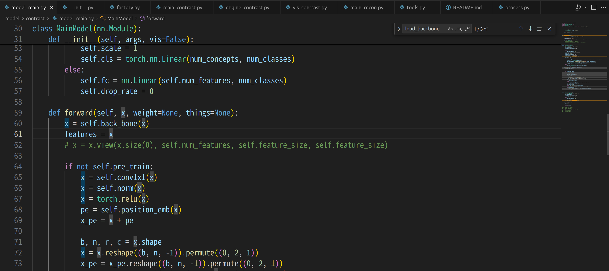

# BotCL
## 건드려야 할 곳

forward에서 x=self.back_bone()은 가장 고레벨을 가지고 오고 있으니까, x=고레벨, y=중레벨, z=저레벨 가져오도록 조정

가져오는 방법은 아마 register_forward_hook사용하면 될듯(킹 갓 gpt)

https://gist.github.com/eminamitani/40df0b87f20aaa588cbcee6405f573ad

해보니까 대충 된거 같긴 함
 
## pytorch
nn.Module이란 무엇일까 
https://seungseop.tistory.com/7