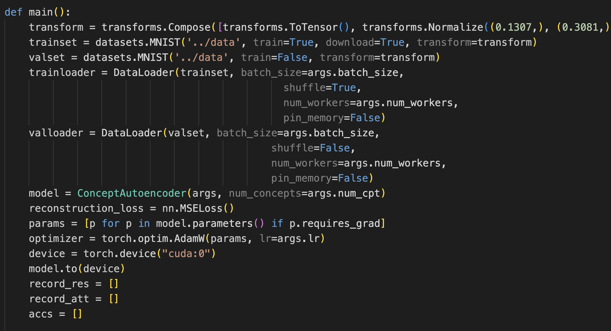

# 다시 시작하자

記録サボりすぎたので切り替えて頑張って記録しようと思います

중간발표 끝났잖아 한잔해

# pytorch
main_recon.py는 mnist용

* transforms.Compose
    https://pytorch.org/vision/stable/transforms.html

    Data augmentation을 위한 툴
    |함수|설명|
    |:---:|:---:|
    |transforms.Resize(size=(64,64))|이미지 크기를 (64, 64)로 변경|
    |transforms.RandomHorizontalFlip(p=0.5)|이미지를 좌우반전, p는 확률(0.5면 50%)|
    |transforms.toTensor()|이미지를 텐서로 변형, pixel값들을 [0~255]에서 [0.0~1.0]으로 자동 변환|
    
    이건 오래된 모듈 torchvision.transforms이고 torchvision.transforms.v2이 최신

