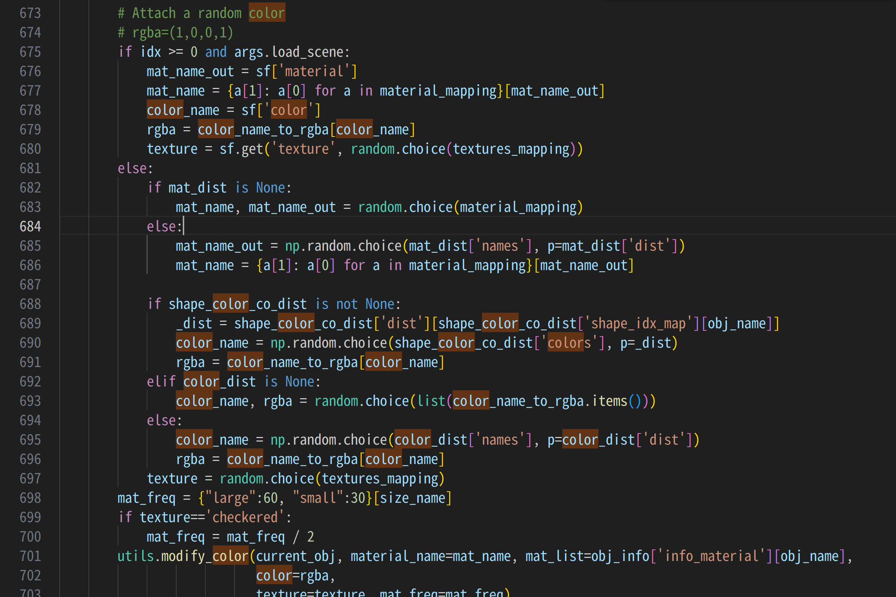

# Super-Clevr

## 실행방법
1. vscode에서 docker열고 컨테이너에서 clever-clevr 오른쪽 클릭
2. vscode랑 attach선택
3. work 폴더 들어가면 super-clevr 폴더 들어있음

## color관련
image_generation->data->super_restore_render_images.py 읽는중

아마 673번째 줄부터 생성한 blnder_object에 랜덤한 색 입히는 듯 함

object랑 material 차이를 아직 잘 몰겄음

# BotCL
