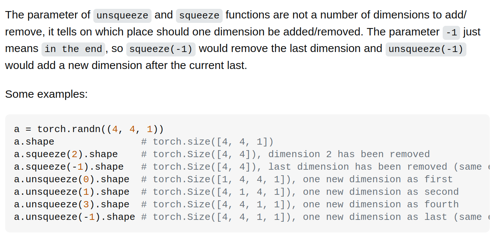
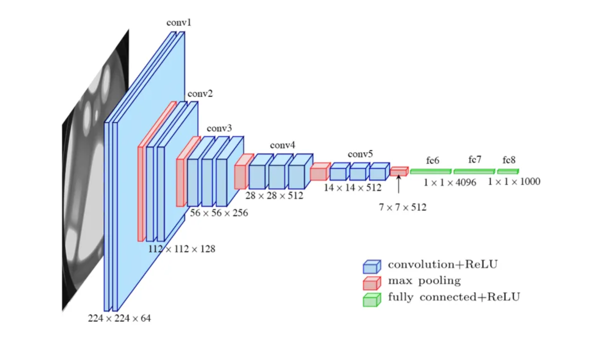
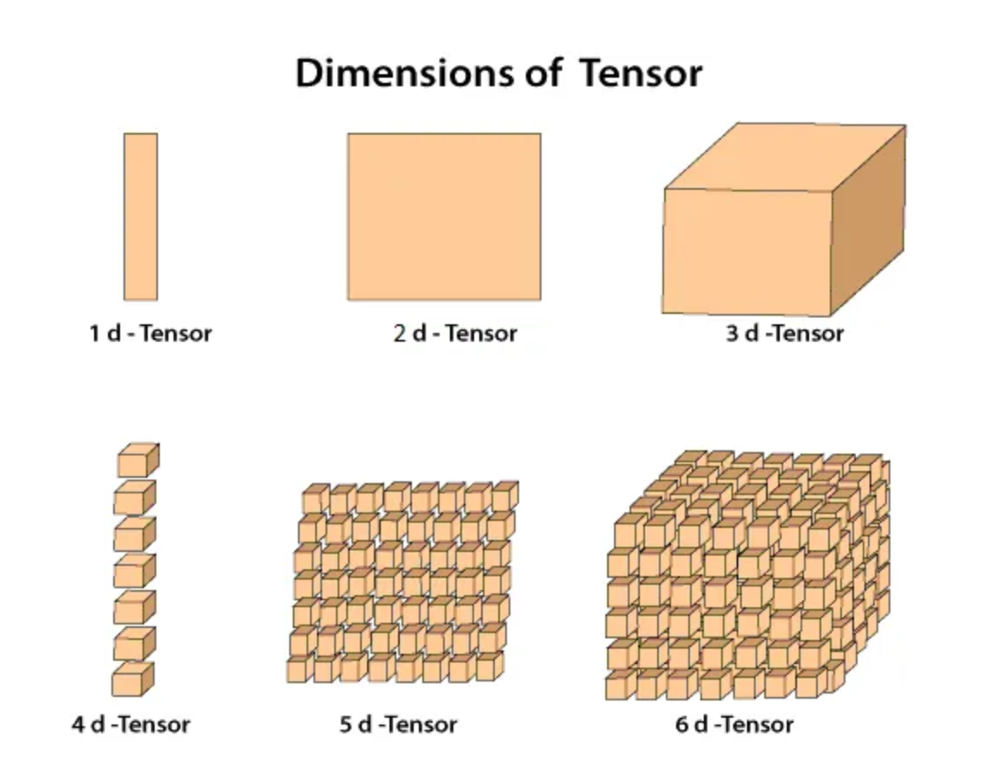

# 10.1 

## pytorch

* torch.squeeze(input, dim=None) &rarr; Tensor
    
    1. input에 있는 차원이 1인 차원을 제거

        Ex) $input = A \times; 1 \times B \times 1 \times C$면 $A \times B  \times C$를 반환
    
    2. dim이 주어지면 그 인덱스의 차원이 1이면 압축

        Ex) input = $A \times 1 \times B$, squeeze(input, 0)면 변화 없음 

        squeeze(input, 1)이면 $A \times B$

* torch.unsqueeze(input, dim=one)
    지정한 차원(shape쳐서 나온 배열의 인덱스)을 삭제
    

* 차원에 대한 이해
    BotCL pretraining data랑 똑같은(비슷한) 그림
    

    단, BotCL 데이터의 차원은 
        
        x output: torch.Size([256, 512, 7, 7])
    같이 4차원임. 4차원 텐서는 아래와 같이 생김

    

        의문점: 왜 x는 squeeze해야만 했을까? fc layer들어가기 전에 1x1차원을 삭제하는데 어째서? 

        ChatGPT 왈: maxpool의 출력: (batch_size, num_features, 1, 1)
    
        여기서 1x1 차원은 공간적인 정보를 포함X, max pool로 인해 각 채널의 요약된 특징을 1개의 값으로 응축한것. 실질적인 정보는 (batch_size, num_features)과 같음