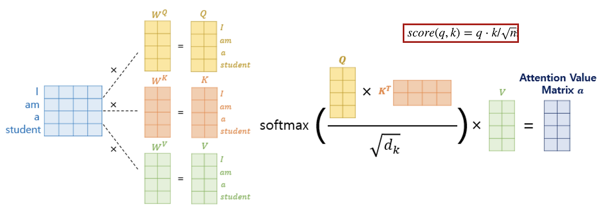

# Attention Method

* $Q, K, V$について

    * $Q\mathrm{(Query)}$ : 検索クエリ
        * **「今の自分を理解するために、周りのどの単語に注目すべきか？」**という情報。

        * 例：文の中に「彼」という単語があれば、「この『彼』が指す具体的な名前はどこ？」という探索情報を持つ。
    * $K\mathrm{(Key)}$ : インデックス
        * **「私はこういう特徴を持つ単語です」**という、他の単語（$Q$）から見つけられるための目印。
        * 例：「太郎」という単語のKeyは、「私は固有名詞で、主語になれる存在です」という特徴を強調する。
    * $V\mathrm{(Value)}$ : 中身
        
        * **「最終的に伝えたい本当の意味」**です
        * $Q$ と $K$ の相性が良かった場合、この $V$ の情報が $Q$ に送られる。
* $\mathrm{Attention}$の計算

    以下にAttentionの計算式を示す。
    
    $$
    \text{Attention}(Q, K, V) = \text{softmax}\left(\frac{QK^\top}{\sqrt{d_k}}\right)V
    $$
    
    * 内積(Dot Product)を取る理由：
    
        数学的に内積の値が大きいほど、同じ向きを持つことを意味する。つまり、内積の計算は二つのベクトル$Q, K$の類似度を数値化する過程である。
    * 活性化関数 $\mathrm{softmax}$ の役割について

        $$
        \mathrm{softmax}(z_i) = \frac{e^{z_i}}{e^{z_1} + \cdots + e^{z_n}} = \frac{e^{z_i}}{\sum_{j=1}^{n}e^{z_{j}}}
        $$

        $\mathrm{softmax}$の特徴
        
        1. 確率分布生成（正規化） : 出力が全部0~1の間の数値になり、総合が1になる。
        2. 指数関数$e^x$を使う理由：
            
            * 微分しても自分自身になるので微分が便利（誤差逆伝播で偏微分）
            * 全ての出力が正の値を取る
            * 微分が単純だから、不動少数点演算が安定的
            * クロスエントロピー計算も都合がいい（$\logの計算$）  
        
        こうして計算された確率分布は重み (Attention Weight) として使われ、この重みを$V$に掛け算することで関連性の高い単語の $V$ は強く残り、低いものは消える。これが集まって、その単語の「周囲の文脈を反映した新しいベクトル（コンテキストベクトル）」が完成する。
    * $\sqrt{d_k}$の意味:スケーリング
        
        $\mathrm{softmax}$関数の入力である内積の値が大きすぎると、勾配消失問題が起こってしまう。

        
